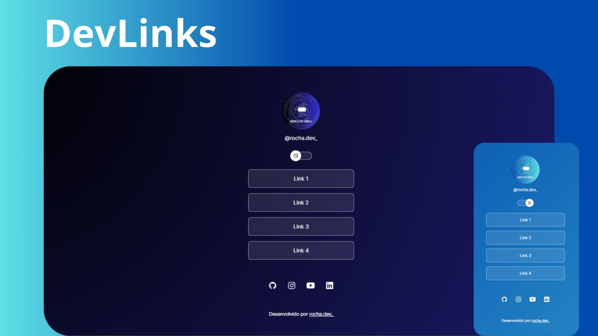

<h1 align="center"> DevLinks </h1>

Projeto desenvolvido durante o curso Discover, promovido pela Rocketseat para ensino de tecnologias WEB.  
<a href="https://lp.rocketseat.com.br/devlinks/inscricao?utm_source=github&utm_medium=descricao&utm_campaign=capture-devlinks&utm_term=organic&utm_content=descricao-github-mayk-brito">Estude esse projeto em formato de vídeo clicando aqui.</a>

  <a href="#-tecnologias">Tecnologias</a>&nbsp;&nbsp;&nbsp;|&nbsp;&nbsp;&nbsp;
  <a href="#-projeto">Projeto</a>&nbsp;&nbsp;&nbsp;|&nbsp;&nbsp;&nbsp;
  <a href="#-layout">Layout</a>&nbsp;&nbsp;&nbsp;|&nbsp;&nbsp;&nbsp;
  <a href="#memo-licença">Licença</a>

  

 

  

## 🚀 Tecnologias

Esse projeto foi desenvolvido com as seguintes tecnologias:

- HTML e CSS
- JavaScript
- Git e Github
- Figma

## 💻 Projeto

O DevLinks é um inovador agregador de links, projetado para servir como um elegante cartão de visitas online. Com seu design moderno e funcionalidade intuitiva, o DevLinks permite aos usuários compartilharem uma coleção de links importantes em um formato profissional e acessível. Além disso, o projeto oferece uma experiência personalizável com dois modos de visualização: claro e escuro, para atender às preferências individuais dos usuários.

## 🔖 Layout

O layout foi personalizado, mas você pode visualizar o layout do projeto original através [DESSE LINK](https://www.figma.com/community/file/1187422022288947321). É necessário ter conta no [Figma](https://figma.com) para acessá-lo.

## :memo: Licença
